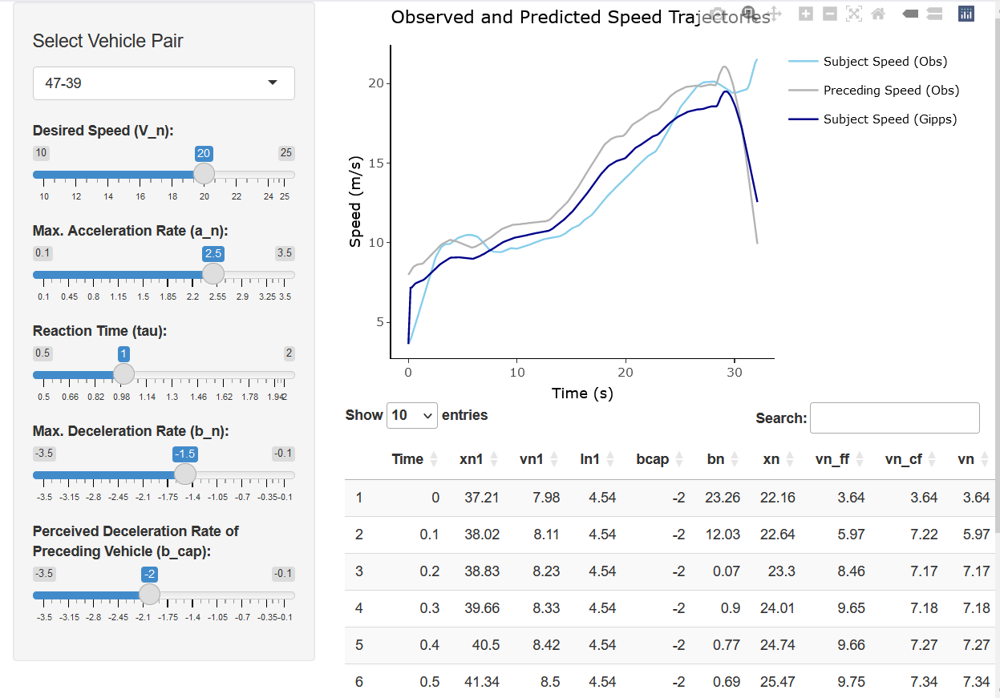

## Introduction to data analysis with R using NGSIM vehicle trajectory data

This intensive workshop offers attendees the opportunity to learn various data analysis techniques in R programming language. The data set used in this workshop is [NGSIM vehicle trajectory data](https://datahub.transportation.gov/stories/s/Next-Generation-Simulation-NGSIM-Open-Data/i5zb-xe34/).

At the end of the workshop, attendees will create a shiny application to explore the Gipps car-following model. All materials will remain available on Github.  

### Contents

**Data import and export**

**Data exploration and transformation**

-   Summary Statistics

-   Creating new variables

-   Efficiently processing multiple variables

-   Filtering out unwanted observations

**Data visualization**

-   Building a plot layer by layer (ggplot2)

-   Make the plot interactive

-   Combining multiple plots

-   Creating visualization for multiple units

**Writing custom functions**

DAY 2:

**Iteration (Applying the same function on multiple datasets)**

**Saving results**

-   Saving plots as images

-   Sending plots and tables to Word and PowerPoint from R

-   Sending editable plots to Powerpoint for animation

**Building an interactive application**
